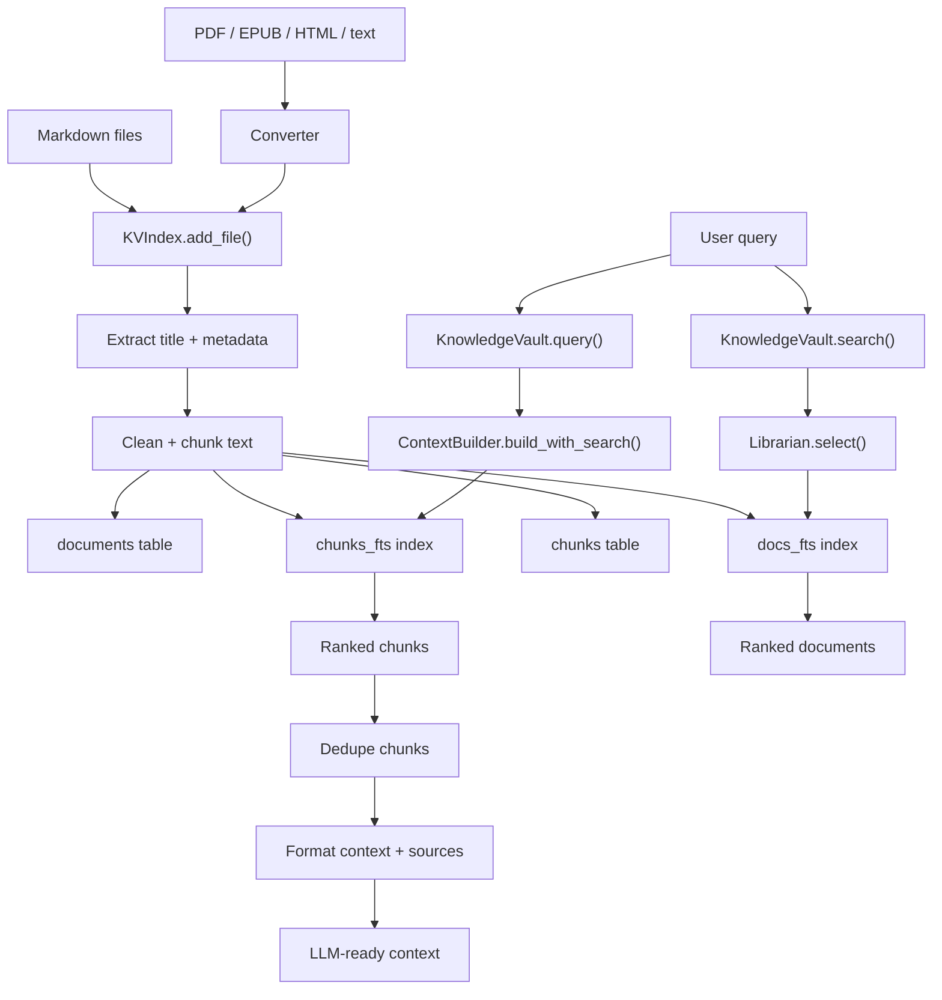
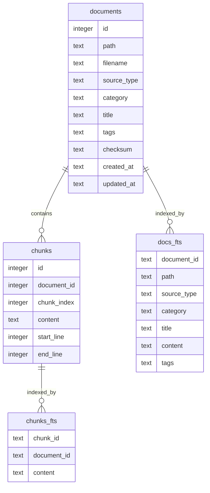
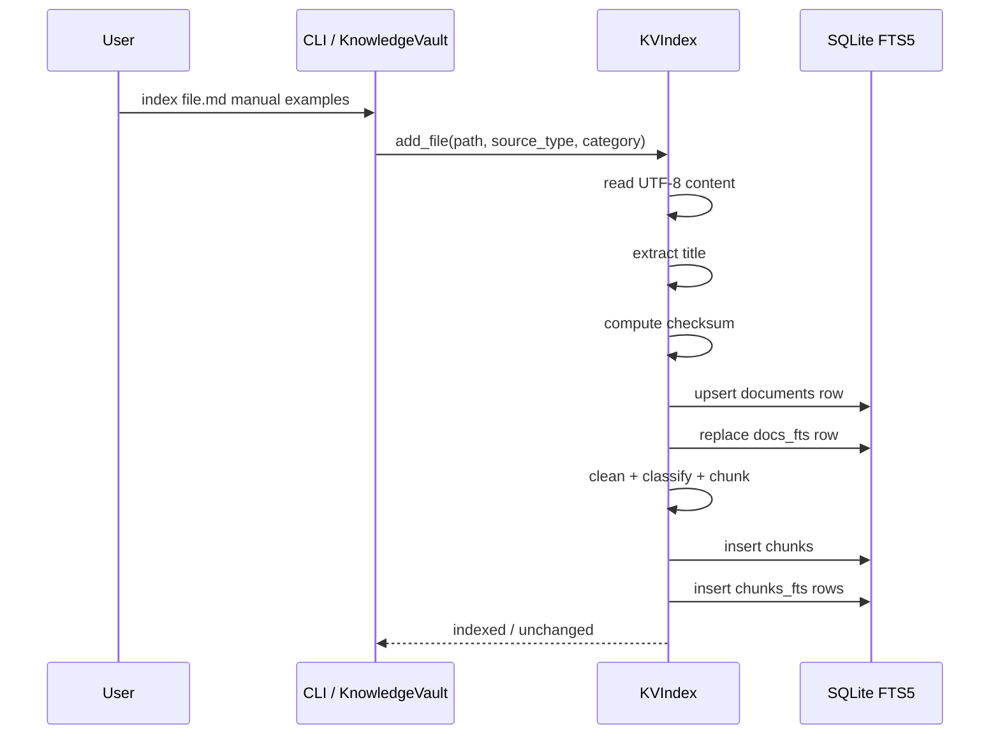
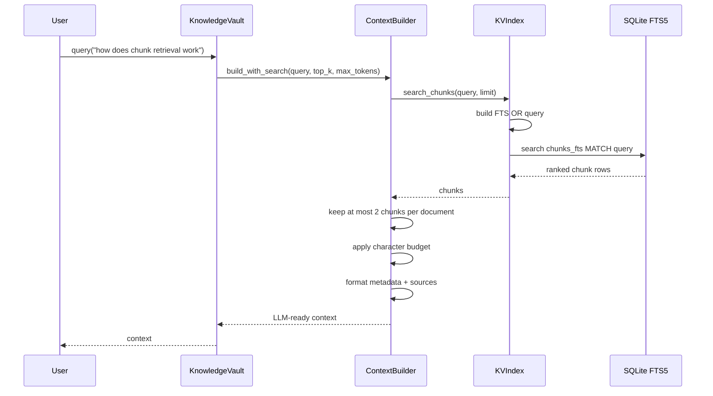

# JAS RAG Architecture

JAS RAG is a local-first retrieval baseline. It uses SQLite FTS5 for keyword retrieval, stores both document-level and chunk-level indexes, then formats ranked chunks into LLM-ready context.

It does not use embeddings, a vector database, a reranker, or an external API.

## System overview



## Main components

| Component | File | Role |
| --- | --- | --- |
| Orchestrator | `kv/__init__.py` | Public API that wires indexing, search, conversion, health, and context building |
| CLI | `kv/__main__.py` | Command entry point for indexing, querying, stats, health, and repair |
| SQLite index | `kv/sqlite/index.py` | Database schema, FTS5 indexes, file indexing, chunking, search, health, repair |
| Context builder | `kv/builder/context.py` | Converts ranked chunks or documents into structured LLM-ready context |
| Librarian | `kv/librarian/librarian.py` | Document-level search with simple intent/category/source heuristics |
| Converter | `kv/sources/converter.py` | Optional PDF, EPUB, HTML, text, and Markdown conversion into Markdown |
| Eval harness | `kv/eval_retrieval.py` | Golden-query retrieval checks for health, top-1, top-3, and empty results |

## Data model



## Indexing flow



The checksum prevents unchanged files from being re-indexed. If a known file changes, old document and chunk FTS rows are removed before the new content is inserted.

## Query flow



## Search flow

`query` and `search` are different paths:

- `query` searches chunks and returns formatted context.
- `search` searches documents and returns document metadata.

`search` uses `Librarian.select()`:

1. Detect simple intent from keywords.
2. Search priority categories first.
3. Search all documents.
4. Boost matches by source type, category, and title.
5. Deduplicate by path.
6. Return top documents.

## Retrieval behavior

JAS RAG builds FTS5 queries using OR logic across words. This favors recall over strict exact matching.

Example:

```text
how does chunk retrieval work
```

becomes:

```text
how OR does OR chunk OR retrieval OR work
```

SQLite FTS5 ranks the matching rows. The context builder over-fetches chunk candidates, then keeps a diverse set by allowing at most two chunks from the same document.

## Chunking behavior

The chunker is heuristic and intentionally simple:

1. Strip YAML frontmatter.
2. Strip HTML comments.
3. Normalize whitespace.
4. Classify content shape:
   - structured
   - list
   - flat PDF
   - narrative
   - flat/reference
5. Split by headings, sentences, line groups, or word windows depending on content shape.
6. Merge tiny chunks.
7. Hard-split pathological long chunks.

Default targets:

- approximate chunk size: 2000 characters
- overlap: 300 characters
- maximum chunk size: 4000 characters

## Health checks

`python3 -m kv health` reports:

- document count
- document FTS row count
- chunk count
- chunk FTS row count
- orphan document FTS rows
- orphan chunk FTS rows
- uncategorized documents
- oversized chunks
- max chunk character count

`python3 -m kv repair-health` removes FTS rows whose parent rows no longer exist.

## Evaluation

The eval harness checks retrieval against `kv/eval_queries.jsonl`.

It validates:

- health status
- top-1 match rate
- top-3 match rate
- empty-result behavior

Run:

```bash
python3 -m kv.eval_retrieval --strict
```

## Design tradeoffs

| Decision | Benefit | Cost |
| --- | --- | --- |
| SQLite FTS5 instead of vector DB | Local, inspectable, no API, low setup | Weaker semantic matching |
| Chunk-level retrieval for `query` | Better context precision | More moving parts than document-only search |
| Document-level `search` path | Useful for browsing matches | Different behavior from `query` |
| Character-based token estimate | No tokenizer dependency | Approximate budgets |
| Heuristic chunking | Simple and dependency-light | Not ideal for every document type |

## When to add vector search

Add vector search only after the baseline proves insufficient:

1. Build a golden-query eval set.
2. Confirm keyword retrieval fails important cases.
3. Confirm failures are semantic, not caused by missing text, poor chunking, or weak queries.
4. Add vector search as a separate retrieval path.
5. Compare FTS5, vector, and hybrid results with the same eval set.

Until then, the FTS5 baseline is easier to debug, explain, and publish.
